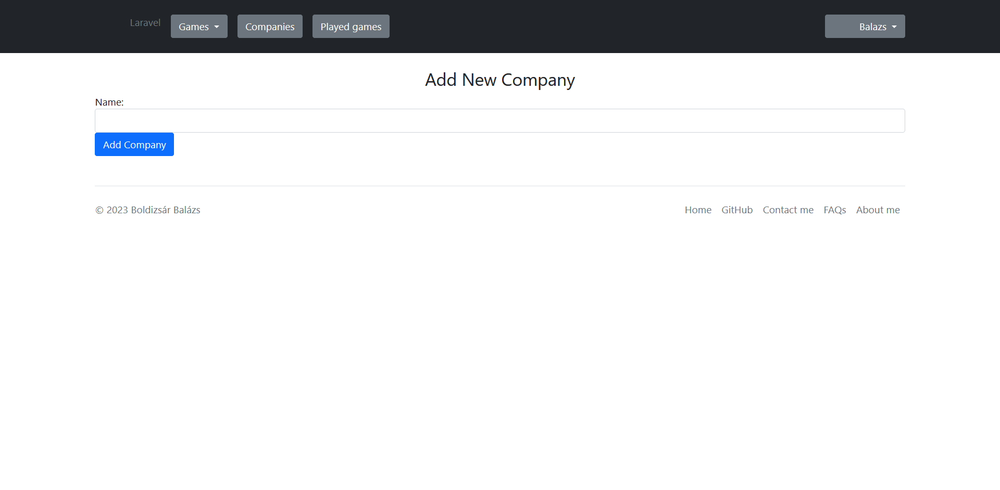

## 1. Áttekintés
A rendszer célja egy Webes felülettel rendelkező videójáték megjelenítő weboldal létrehozása. Ezen felületen a regisztrált felhasználók bejelölhetik, hogy milyen játékot játszottak eddig ki, kilistázhatják a játékokat,meglévő kijátszásokat törölhetnek, megtekinthetik a játékokhoz kapcsolódó tulajdonságokat (cégnév, játék típus). Regisztráció nékül ezen funkciók nem elérhetőek, a felhasználó csak betekintést kap a weboldalra. A weblap része lesz egy felhasználó kezelő rendszer, ahol három különböző szint lesz, ezek a vendég, felhasználó és az admin. A weblap teljes mértékben ingyenes lesz, nincs semmi tartalom vagy extra funkció amiért fizetni kellene.

## 2. Jelenlegi helyzet

A megrendelő szeretné jobban elérhetővé tenni a felhasználók kijátszott játékainak megtekintését és tárolását.
A megrendelő számára kiemelten fontos, hogy az oldal könnyen kezelhető és áttekinthető legyen. Ezért kért fel minket, hogy készítsünk számára egy weblapot, egy virtuális teret amely ezt a szándékát segíti.
A teret egy online játék listázó formájában szeretné megvalósítani.
Azt szeretné, hogy a játék adatbázist egy helyre gyűjtenék össze, ezzel megspórolva a sok-sok keresést és tárolni tudják a kijátszott játékoka és a játékokhoz kapcsolódó tulajdonságokat
Lehetőséget akar biztosítani, hogy az felhasználók minden publikus információt megtudjanak a játékokról, segítve ezzel a minél szélesebb információ elmélyítését. A megrendelő felismerte azt, hogy manapság az embereknek szinte mindig van internetelérésük és eszközük ennek használatára.
Ezt megragadva kérte, hogy készítsünk el egy olyan weblapot, ahol bármikor megtekinthetik a számítógépes játékokat és azoknak az információit, cégneveket az egyes játékokhoz.

## 3. Követelménylista

1. Bejelentkezési felület:
 * A felhasználók ezen a felületen tudnak bejelentkezni a weboldalra a bővebb elérhetőség érdekében.
2. Regisztrációs felület:
 * A felhasználók ezen a felületen tudnak beregisztrálni a weboldalra.
3. Játékok menüpont:
 * A felhasználók itt érik el a bővebb funkciókat
 * Meg tudják tekinteni a játékokat, és hozzá tudják adni a már kijátszottak közé
 * Tudják törölni a kijátszott listájukból
4. Jogosultságok:
 * Admin: Teljes hozzáférése van a weboldalhoz, szerkesztheti, kilistázhatja és törölheti a felhasználók adatait is.
 * Felhasználó: Tud a játékok fülön hozzáadni kijátszott játékokat, tudja listázni a profilját.
 * Vendég: Csak egy betekintő áll rendelkezésére amikor megnyitja a weblapot.

 ## 4. Jelenlegi üzleti folyamatok modellje

## 5. Igényelt üzleti folyamatok modellje
    5.1 Bejelentkezés
        5.1.1 Játékok
                5.1.1.1 Új kijátszott játék rögzítése
                5.1.1.2 Játékok listázása
                5.1.1.3 Kijátszott játékok listázása
        5.1.2 Játékok
                5.1.2.1 Cégek listáázsa
                5.1.2.2 Cégekhez való játékok listázása
        Admin joggal rendelkezőknek:
        5.1.3 Felhasználók szerkesztése
        5.1.4 Felhasználók listázása
        5.1.5 Felhasználók törlése
        5.1.6 Új játékok feltöltése
        5.1.7 Cégek feltöltése
        5.1.8 Játékok és cégek módosítása
        5.1.9 Kijelentkezés
    5.2 Regisztráció

## 6. Használati esetek

- **Admin**
  - **Hozzáfér a felhasználók listájához**
    - **Tartalma:**
    - **Felhasználónév**
    - **E-mail cím**
    - **Jogkör**
  - **Felhasználó adatainak szerkesztése**
  - **Felhasználó adatainak törlése**
- **Felhasználó**
  - **Saját kijátszott játékok megtekintés**
    - **Kijátszott játékok felvétele**
    - **Játékok megjelenítése**
    - **Cégek megjelenítése**
    - **Kijátszott játékok törlése**

## 7. Képernyőterv

Főoldalterv:
  

Regisztrációs oldal terv:
  

Bejelentkezés oldal terv:
  

Games oldal terv:
  

Games oldal terv:
  

Company oldal terv:
  

Játszott játékok oldal terv:
  

Profil oldal terv:
  

Admin[List users] oldal terv:
  

Admin[Add game] oldal terv:
  

Admin[Add company] oldal terv:
  
## 8. Forgatókönyv

 A program nem kíván különösebb telepítési és használati útmutatót. Elég, ha egy grafikus felülettel rendelkező webböngésző fel van telepítve ( alapértelmezett: windows - internet explorer / edge, linux: mozilla, mac - safari ). A felhasználó beüti az oldal címét: xyz.com a böngésző címsorába és rögtön át lesz irányítva az oldalra. Az oldal tartalmát a webszerver szolgáltatja a mögötte lévő adatbázis segítségével. Az oldalra átírányítva a felhasználó megkezdheti a saját órarendjének összeállítását ha regisztrált az oldalra, majd bejelentkezett. Ha a felhasználónak bármi nemű problémája akad az oldal működésével kapcsolatban, akkor a megadott elérhetőségek alapján tudja ezt jelezni az oldal karbantartói felé.
 Az oldal adminisztrátorai moderálják az oldalra nem illő tartalmakat a megfelelő eszközök segítségével.
 Az oldal karbantartásáért felelős csapat pedig az oldal rendeltetésének megfelelő működését ellenőrzi és javítja a felmerülő problémákat.

 ## 9. Fogalomszótár
- **UML** - Unified Modeling Language
- **Reszponzív felület** - Mobilon, Tableten, PC-n igazodik a
képernyőhöz a felület mérete, azaz több eszközön is probléma nélkül
üzemelhet
- **Corrective Maintenance:** A felhasználók által felfedezett és "user reportban"
elküldött hibák kijavítása.
- **Adaptive Maintenance:** A program naprakészen tartása és finomhangolása.
- **Perfective Maintenance:** A szoftver hosszútávú használata érdekében végzett
módosítások, új funkciók, a szoftver teljesítményének és működési
megbízhatóságának javítása.
- **Preventive Maintenance:** Olyan problémák elhárítása, amelyek még nem
tűnnek fontosnak, de később komoly problémákat okozhatnak.