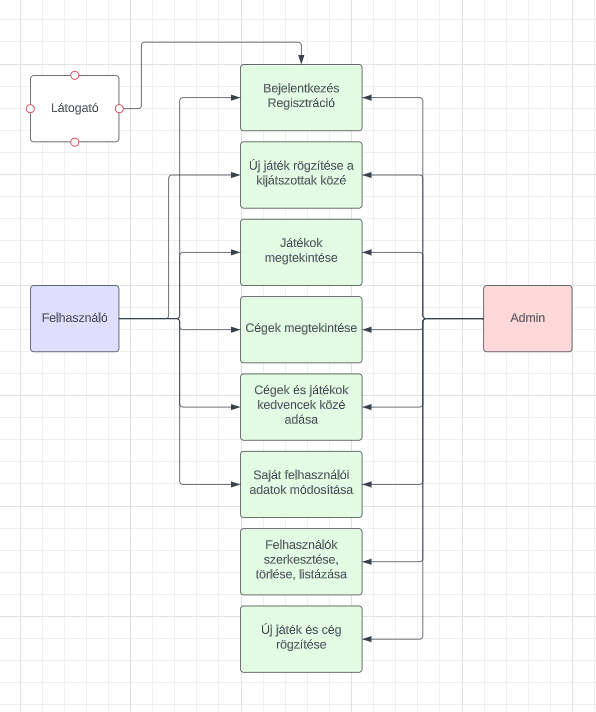

## 1. Rendszer célja
A rendszer célja egy Webes felülettel rendelkező elektronikus kijátszott játékok listázó létrehozása.
Ezen felületen a regisztrált felhasználók bejelölheti a kijátszott játékokat, új játékokat és cégeket vehet fel a kedvencek közé.Szerkeszthetik a meglévő kijátszott játékait és a kedvencek listát.
Regisztráció nékül ezen funkciók nem elérhetőek, a felhasználó csak betekintést kap a weboldalra és csak az adatokat tudja listázni.
A weblap része lesz egy felhasználó kezelő rendszer, ahol három különböző szint lesz, ezek a vendég, felhasználó és az admin.
A weblap teljes mértékben ingyenes lesz, nincs semmi tartalom vagy extra funkció amiért fizetni kellene.

## 2. Projektterv
### Projekttszerepkörök:
  * Termék tulajdonos: Boldizsár Balázs
### Projekttmunkások és felelősségek:
  * Backend munkálatok: Boldizsár Balázs
  * Frontend munkálatok: Boldizsár Balázs

### Feladatuk: 
- adatbázis létrehozása az adatok tárolásához
- megfelelő funkciók elkészítése az oldal megfelelő működésének érdekében
- felhasználói felület kialakítása
- felhasználókezelés alkalmazása.

### Ütemterv:
 - 06.15 Követelmény specifikáció 
 - 06.15 Funkcionális specifikáció
 - 06.15 Rendszerterv
 - 06.21 Adatbázis kialakítása
 - 06.21 Felhasználókezelés megvalósítása
 - 06.21 Backend funkciók elkészítése
 - 06.21 Frontend design megtervezése
 - 06.21 Felhasználói felület kialakítása

## 3. Üzleti folyamatok modellje

## 4. Követelmények

**Funkcionális követelmények**
  - **Felhasználók adatainak tárolása**
  - **Felhasználók tudják változtatni adataikat**
  - **Felhasználók kijátszott játékainak tárolása**
  - **Játékok tárolása**
  - **Cégek tárolása**
  - **Játékokhoz tartozó adatok tárolása**
  - **Cégekhez tartozó adatok tárolása**
  - **Adminisztrátor tudja szerkeszteni a tárgyak adatait és a felhasználók adatait**

  **Nem funkcionális követelmények**
  - **A felhasználók nem férnek hozzá egymás adataihoz**
  - **A felhasználók nem férnek hozzá az admin felülethet**

  **Törvényi előírások, szabványok:**
  - **GDPR-nek való megfelelés**

## 5. Funkcionális terv

**Rendszerszereplők:**
  - **Adminisztrátor**
  - **Felhasználó**
  - **Vendég**

  **Rendszerhasználati esetek és lefutásaik:**
  - **Adminisztrátor**
    - **Képes felhasználókat törölni**
    - **Tudja módosítani a felhasználók jelszavát és adatait is**
    - **Látja az összes regisztrált felhasználót**
    - **Módosítani tudja a játékokat és cégeket, azok adatait**
    - **Teljes hozzáférése van a rendszerhez**
  - **Felhasználó**
    - **Megtekintheti a játékokat**
    - **Megtekintheti a cégeket**
    - **Megtekintheti az kijátszott játékait**
    - **Felvehet új játékoat a kijátszottak közé**
    - **Felvehet kedvencek közé játékokat és cégeket**
    - **Kijátszott játékokat tudja törölni**
    - **Módosíthatja a saját adatait**
    - **Módosíthatja jelszavát**
  - **Vendég**
    - **Láthatja a játékok és cégek listáját**
    - **Képes regisztrálni és bejelentkezni**

  - **Menü-hierarchiák:**
    - **Játékok**
    - **Cégek**
    - **Bejelentkezés**
    - **Regisztráció**

    - **Bejelentkezés után:**
      - **Felhasználók listája:** kizárólag admin joggal rendelkező felhasználóknak
        - **Felhasználó adatainak módosítása**
        - **Felhasználók törlése**

      - **Profil**
      - **Kijátszott játékaim**
      - **Kedvenc játékaim**
    - **Kedvenc cégeim**
      - **Kijelentkezés**
